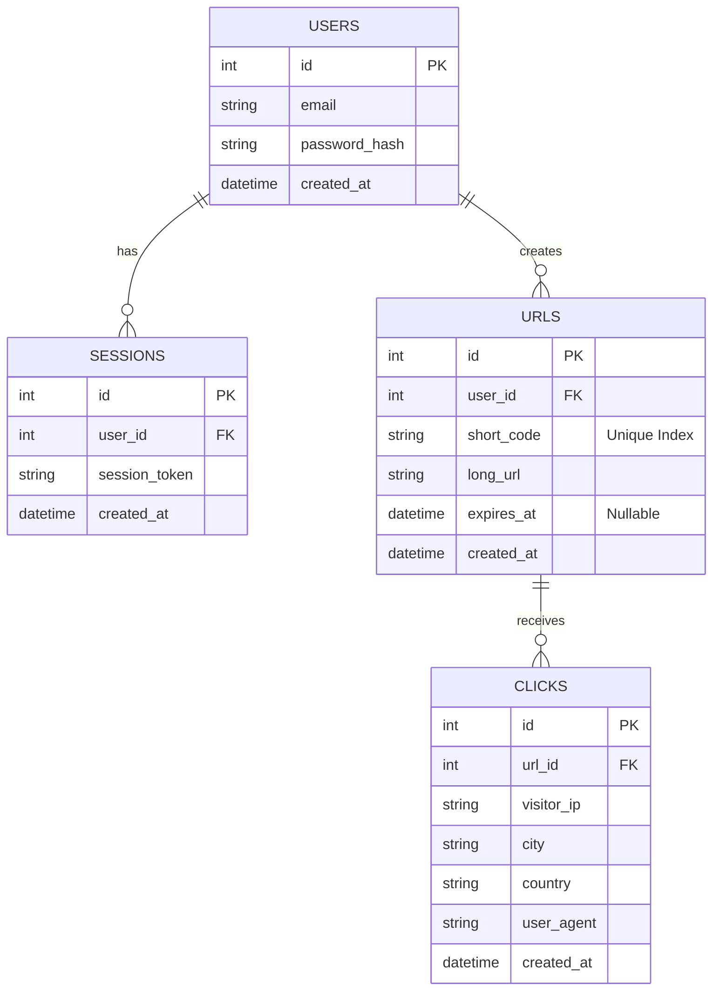

# 🚀 Shortify - Full-Stack URL Shortener Service

**Shortify** is a high-performance, secure web application for shortening long URLs, managing custom aliases, generating dynamic QR Codes, and tracking detailed audience statistics.

Built with a modern architecture separating the **Backend (Go)** and **Frontend (React 19)**, this project demonstrates the implementation of key web development concepts: secure authentication, relational database management, Rate Limiting, and IP geolocation.


---

## 📑 Table of Contents

1. [✨ Key Features](#-key-features)
2. [🏗️ Technical Architecture](#️-technical-architecture)
3. [💾 Database Schema](#-database-schema)
4. [🚀 Installation and Startup](#-installation-and-startup)
5. [📖 Usage Guide (Scenarios)](#-usage-guide-scenarios)
6. [📱 Important Note: QR Codes & Local Environment](#-important-note-qr-codes--local-environment)
7. [⚙️ API Documentation](#️-api-documentation)
8. [🔮 Future Improvements (Roadmap)](#-future-improvements-roadmap)

---

## ✨ Key Features

### 🔗 Link Management
* **Smart Shortening**: Automatic generation of short codes (e.g., `/aBz12`) via a random alphanumeric algorithm ensuring uniqueness.
* **Custom Aliases**: Ability for the user to define their own suffix (e.g., `/summer-promo-2026`) to improve readability and branding.
* **Scheduled Expiration**: Optional setting of an expiration date and time. Once the date has passed, the link becomes inactive and returns an HTTP `410 Gone` status with an explanatory page for the user.
* **Edit & Delete**: Full flexibility to modify the destination URL (if the target changes) or delete an obsolete link.

### 📊 Analytics & Tracking
* **Centralized Dashboard**: Overview of all created links, easily sorted and managed.
* **Real-time Statistics**:
    * **Volume**: Total number of clicks.
    * **Uniqueness**: Number of unique visitors (based on IP hashing).
    * **Geolocation**: Precise identification of the visitor's city and country (via external API).
    * **History**: Detailed log of recent accesses (IP, Date, Location).

### 🛡️ Security & Performance
* **Robust Authentication**: Complete sign-up and login system. Passwords are hashed with **bcrypt** and sessions are secured via **HttpOnly Cookies** (protection against XSS attacks).
* **Rate Limiting**: Custom middleware developed in Go to limit the number of requests per IP over a time window, protecting the API against spam and brute-force attacks.
* **QR Codes**: Instant generation of QR Codes redirecting to the shortened URL, downloadable for printing or sharing.

---

## 🏗️ Technical Architecture

### Backend (REST API)
* **Language**: Go (Golang) 1.25
* **HTTP Server**: Usage of the standard `net/http` library with a custom multiplexer (`ServeMux`) for optimal performance without a heavy framework.
* **Database**: SQLite3 (lightweight, single file, zero complex configuration).
* **Key Libraries**:
    * `golang.org/x/crypto`: For secure password hashing.
    * `github.com/mattn/go-sqlite3`: Robust SQL driver.
    * `github.com/skip2/go-qrcode`: Fast QR image encoding.

### Frontend (SPA)
* **Framework**: React 19
* **Build Tool**: Vite (for instant startup and fluid HMR).
* **Routing**: React Router v7 for client-side navigation.
* **Style**: Native Modular CSS (no heavy CSS framework), ensuring a lightweight footprint.
* **UX/UI**: Modern interface with interactive modals, toast notifications, and "Glassmorphism" design.

---

## 💾 Database Schema

The project uses a relational SQLite database. Here is the table structure:



---

## 🚀 Installation and Startup

**Prerequisites**: Make sure you have [Go](https://go.dev/) and [Node.js](https://nodejs.org/) installed on your machine.

### 1. Clone the repository
```bash
git clone [https://github.com/Pazirs/url-shortener.git](https://github.com/Pazirs/url-shortener.git)
cd url-shortener
```

### 2. Start the Backend (API)
The Go server handles the business logic and automatically creates the `urls.db` database file at the root if it doesn't exist.

```bash
# At the project root
go mod tidy          # Install Go dependencies
go run main.go       # Start the server on port 8080
```
> ✅ The API server listens on: `http://localhost:8080`

### 3. Start the Frontend (React)
Open a **new terminal** to launch the user interface.

```bash
cd url-shortener-frontend
npm install          # Install JS dependencies
npm run dev          # Start the Vite development server
```
> ✅ The interface is accessible at: `http://localhost:5173`

---

## 📖 Usage Guide (Scenarios)

### Scenario 1: Create a temporary marketing link
*You are launching a "Flash" promotion that only lasts 24h.*
1.  Log in to your Dashboard.
2.  Enter your product URL: `https://mysite.com/super-promo`.
3.  Define a catchy alias: `flash-promo`.
4.  Set the expiration date to tomorrow.
5.  Click "Shorten".
6.  **Result**: Share the link `http://localhost:8080/flash-promo`. After 24h, the link will automatically deactivate.

### Scenario 2: Track Newsletter Audience
1.  Shorten the link to your latest blog post.
2.  Send the short link in your email newsletter.
3.  A few hours later, click the **📊 Stats** icon in the Dashboard.
4.  **Result**: Visualize exactly how many subscribers clicked, and discover if they come from Paris, New York, or elsewhere.

---

## 📱 Important Note: QR Codes & Local Environment

A key feature of Shortify is QR Code generation. However, it is crucial to understand the distinction between the development environment and production when using these codes with a smartphone.

### ⚠️ Why doesn't the QR Code work on my phone right now?
Currently, the application runs **locally** on your computer (`localhost`).
* The generated QR code encodes the local URL: `http://localhost:8080/your-alias`.
* If you scan this code with your smartphone, your phone will try to access `localhost`. For the phone, "localhost" means "myself", not your computer. Since the server is not running on the phone, you will get a "Site unreachable" or "Page not found" error.

### 🌍 How does it work in Production?
For QR codes to be functional for the general public, the project must be deployed on a server accessible via the Internet (VPS, Cloud).
1.  The project is hosted on a domain name (e.g., `shortify.io`).
2.  The backend `BASE_URL` environment variable is configured to `https://shortify.io`.
3.  The QR code will then generate: `https://shortify.io/your-alias`.
4.  Since this link is public, any smartphone can scan it and be correctly redirected to your site, anywhere in the world.

> **Tip for local testing**: Connect your phone to the same Wi-Fi network as your PC. Find your PC's local IP address (e.g., `192.168.1.15`) and use this IP instead of `localhost` to access the site from your mobile.

---

## ⚙️ API Documentation

The API is designed according to REST principles. Here are the main endpoints:

| Method | Endpoint | Description | Example Body (JSON) |
| :--- | :--- | :--- | :--- |
| `POST` | `/api/register` | Account creation | `{"email": "...", "password": "..."}` |
| `POST` | `/api/login` | Login (Creates HttpOnly Cookie) | `{"email": "...", "password": "..."}` |
| `POST` | `/api/shorten` | Shorten a URL | `{"url": "...", "custom_alias": "...", "expires_at": "ISO8601"}` |
| `GET` | `/api/my-urls` | Retrieve my links | *None (Requires Session Cookie)* |
| `PUT` | `/api/urls/{code}` | Update URL or Alias | `{"long_url": "...", "custom_alias": "..."}` |
| `DELETE`| `/api/urls/{code}` | Delete a link | *None* |
| `GET` | `/api/stats/{code}` | Get detailed stats | *None* |
| `GET` | `/{code}` | Redirection (Public link) | *None* |

---

## 🔮 Future Improvements (Roadmap)

This project is designed to be scalable. Here are the technical development paths for future versions:

1.  **PostgreSQL Migration**: Replace SQLite with PostgreSQL to support massive load in production and allow horizontal scaling.
2.  **Caching System (Redis)**: Implement Redis to cache redirections (key: alias -> value: url). This would drastically reduce database calls during viral traffic spikes.
3.  **Docker & Orchestration**: Add a multi-stage `Dockerfile` to optimize image size and a `docker-compose.yml` to launch the entire environment (App + DB + Redis) in one command.
4.  **Public API & Tokens**: Set up an API Key system to allow third-party developers to integrate the Shortify shortener into their own applications or scripts.
5.  **Advanced Charts**: Integrate a library like `Recharts` or `Chart.js` in the frontend to visualize click evolution over time (curves) instead of a simple list.

---

